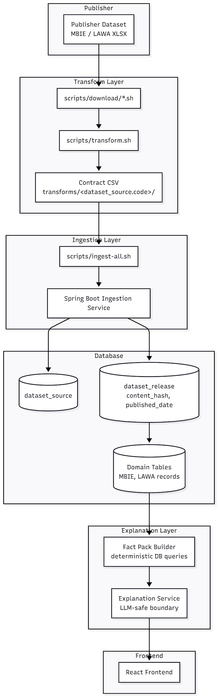
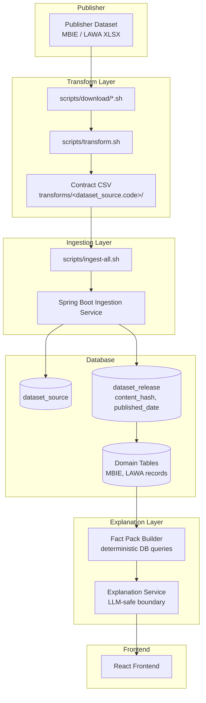
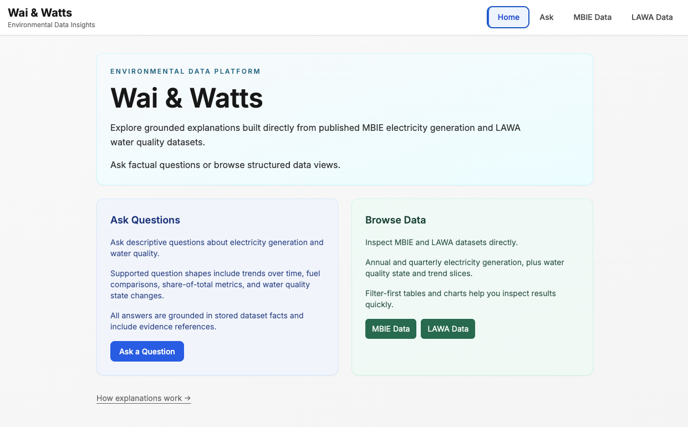
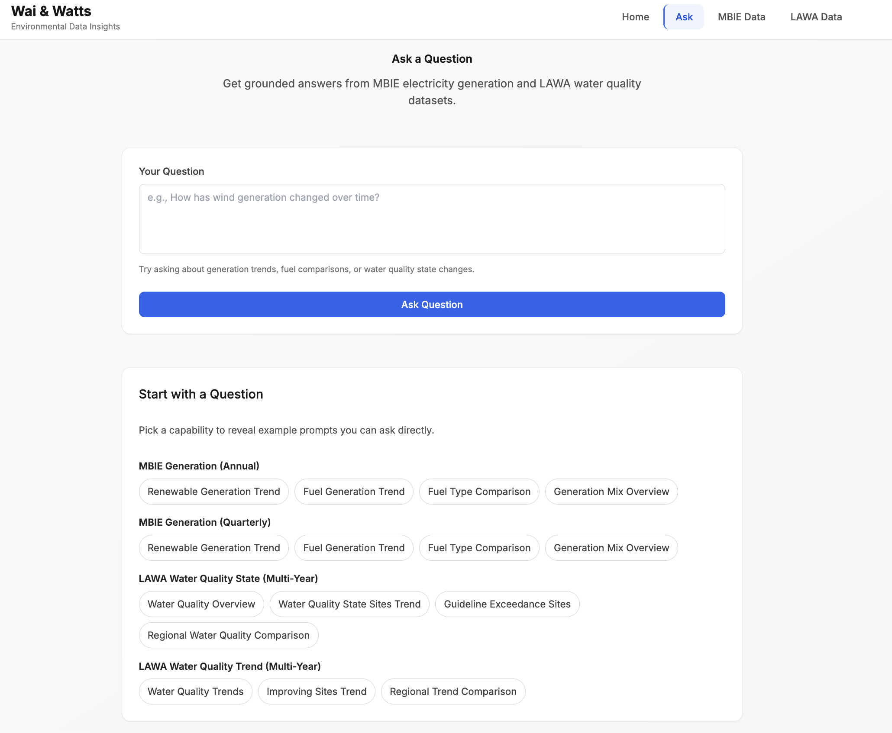
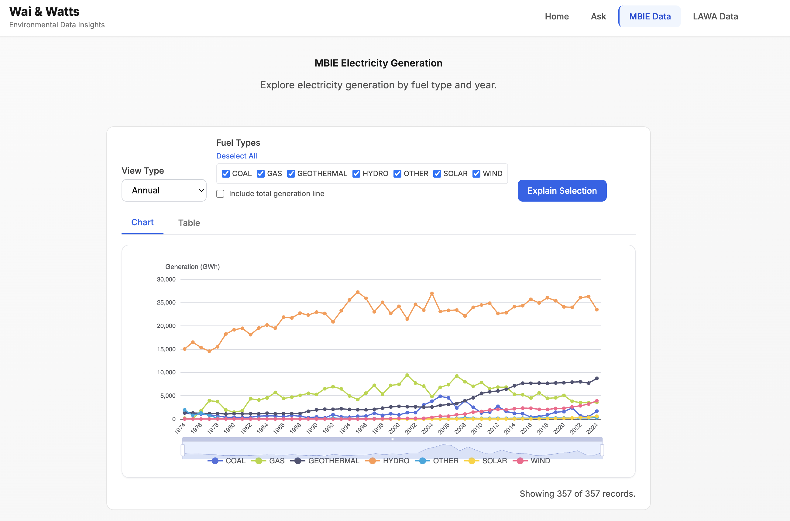
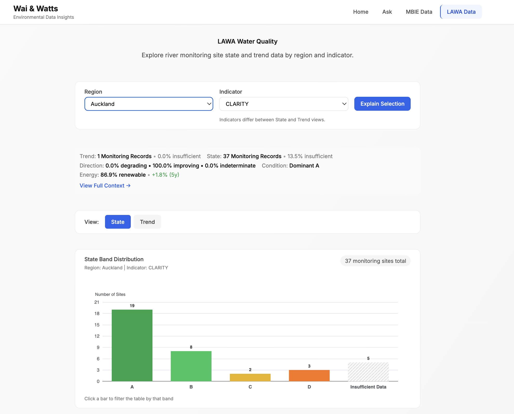

# Wai & Watts
**Lineage-first environmental data platform with grounded LLM explanations**

Wai & Watts is a full-stack data platform that ingests real environmental and energy datasets, preserves dataset lineage, and generates grounded natural-language explanations using a fact-pack architecture that prevents hallucination.

It also serves as a case study in **disciplined AI-augmented engineering**: AI accelerated implementation, while architecture, invariants, and system boundaries remained explicitly human-governed.

---

## Additional Documentation

• [Local Demo Walkthrough](DEMO.md)  
• [Portfolio Summary](docs/11-portfolio-summary.md)  
• [Architecture Overview](docs/01-architecture.md)  
• [Operational Model](docs/04-operational-model.md)

---

# Why This Project Exists

Modern engineering teams are rapidly integrating AI into development workflows.

The harder and more important question is:

> **How do you design architectural guardrails that allow AI to accelerate delivery without compromising correctness, provenance, or system integrity?**

Wai & Watts demonstrates one answer.

The system enforces deterministic ingestion, explicit dataset lineage, and a strict fact boundary between persisted data and any LLM interaction.

The result is a platform where AI can safely explain facts—but cannot invent them.

---

# Architecture Overview



<details>
<summary>Mermaid version</summary>


</details>


---

# Screenshots
Home  


Ask interface  


MBIE generation timeline  


LAWA water quality visualization  


---

# Core Engineering Principles

**Lineage-first**  
Dataset releases are explicit, immutable, and traceable.

**Contract-first**  
Ingestion consumes normalized CSV contracts, not raw publisher files.

**Idempotent by design**  
Database-level uniqueness guarantees ingestion correctness.

**Deterministic and reproducible**  
Every ingestion and explanation can be reproduced exactly.

**LLM-safe by architecture**  
LLMs operate only on structured Fact Packs and never access the database directly.

**AI-governed, not AI-driven**  
AI accelerates implementation, but architectural authority remains human-controlled.

---

# Dataset Lineage Model

Each ingestion produces an immutable `dataset_release` record linked to a `dataset_source`.

Domain records reference their originating dataset_release, ensuring:

• reproducibility of all explanations  
• safe re-ingestion without duplication  
• traceability to the original publisher artifact  
• deterministic reconstruction of system state

Lineage is enforced at the database level via unique content hashes.

---

# System Components

## Backend
- Java / Spring Boot
- Postgres
- Flyway migrations
- Deterministic ingestion lifecycle
- Dataset lineage model

## Frontend
- React
- TypeScript
- Vite
- Tailwind
- TanStack Query

## LLM Layer
- Fact Pack boundary
- Deterministic intent parsing
- Refusal model for unsupported queries

---

# Project Status

Wai & Watts is complete as a portfolio project.

Phase 17 finalized:

- Contract-driven ingestion validation
- Deterministic natural language handling
- Capability registry
- Observability and runbook coverage
- Stable API contracts

---

# Quick Start

## Optional: Configure LLM Provider

The repository includes a checked-in environment template:

```
.env.example
```

Copy it to create your local configuration:

```
cp .env.example .env
```

This file controls LLM provider integration and runtime configuration.

If no LLM provider is configured, Wai & Watts runs in **deterministic stub mode**, allowing the entire ingestion and explanation pipeline to function without external dependencies.

This ensures:

- reproducible local development
- no external API requirement
- deterministic explanation behavior for testing and review

To enable live LLM explanations, set:

```
LLM_PROVIDER=<provider>
LLM_MODEL=<model>
LLM_API_KEY=<key>
```

LLM access remains strictly bounded to Fact Packs regardless of provider configuration.

---

Start everything:

```
docker compose up -d --build
```

Frontend:  
http://localhost:5173

Backend:  
http://localhost:8080

## Load the Demo Data

A fresh database starts with dataset metadata only. To populate the portfolio demo dataset, run the bundled ingest:

```
docker compose run --rm ingest-all --bundle-date 2026-02-06
```

This uses the checked-in workbook bundle and manifest under `backend/src/main/resources/downloads/`, transforms the workbooks into contract CSVs, and ingests all supported datasets:

- `mbie.generation.annual`
- `mbie.generation.quarterly`
- `lawa.water_quality.state.multi_year`
- `lawa.water_quality.trend.multi_year`

After the command completes, open the frontend or verify the data through the API:

```
curl http://localhost:8080/api/v1/datasets/sources
curl "http://localhost:8080/api/v1/mbie/generation/annual?fromYear=2020&toYear=2024"
curl "http://localhost:8080/api/v1/lawa/water-quality/state/multiyear?region=canterbury"
```

For the short portfolio walkthrough, see [DEMO.md](DEMO.md).

---

# Operability Proof

```
docker compose up -d --build

curl http://localhost:8080/api/v1/health

curl http://localhost:8080/api/v1/datasets/sources
```

---

# Example API Usage

List datasets:

```
GET /api/v1/datasets/sources
```

Ask a natural language question:

```
POST /api/v1/explanations/ask
```

---

# Repository Structure

```
backend/
frontend/
docs/
engineering/
scripts/
archive/
```

---

# What This Demonstrates

This project demonstrates the ability to design and implement:

- Production-style ingestion pipelines
- Deterministic data lineage systems
- Contract-driven architecture
- Safe LLM integration patterns
- Full-stack platform engineering
- Operationally reproducible systems
- AI-assisted development with architectural governance

---

# Future Production Extensions (Deliberately Deferred)

- Scheduled ingestion orchestration
- Hosted deployment infrastructure
- Dataset release comparison tooling
- Observability dashboards
- Authentication and multi-tenant access

---

# License

This project is licensed under the MIT License — see the LICENSE file for details.
